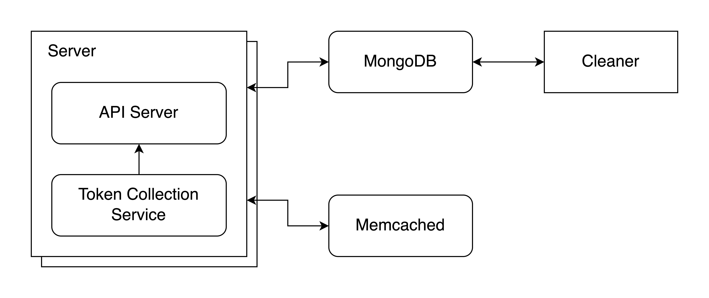

# golang-shorturl

A simple but scalable ShortURL service written in Golang.



## Services
* `server`
    - API backend server
    - Including a token collection service that collects unused ids before getting request
    - May have multiple server running at the same time
* `cleaner`
    - Small service that periodically clean up the expired records from database.

## Build Executables
```sh
go build cmd/server/server.go
go build cmd/cleaner/cleaner.go
```

## Configuration through Environment Variables
Configurations are loaded from the environment variables, if not provided, then the default values will be used.
* `LISTEN_ADDR`: The address that the server listens on, defaults to `:8000`
* `BASE_URL`: The base URL of the service, defaults to `http://localhost:8000`
* `MAX_TOKEN`: The maximum amount of tokens to be generated and stored offline, defaults to `5000`
* `MAX_URL_LEN`: The length limit of url string, defaults to `1024`
* `MAX_ALIVE_DURATION`: The maximum duration the record stays in database, defaults to `8760h`
* `MONGODB_URI`: The uri to connect to mongodb, defaults to `mongodb://localhost:27017`
* `DATABASE`: The database to use, defaults to `shorturl`
* `RECORD_COLLECTION`: The collection to store records, defaults to `records`
* `MEMCACHED_ADDRS`: The addresses of memcached services, separated by comma, defaults to `localhost:11211`

## API Endpoints
### GET `/{id}`
### POST `/api/v1/urls`
Example Request Body (application/json)
```json
{
    "url": "https://www.dcard.tw/f",
    "expireAt": "2021-02-08T09:20:41Z"
}
```
Response
```json
{
    "id": "8RjJue",
    "shortUrl": "http://localhost:8000/8RjJue"
}
```